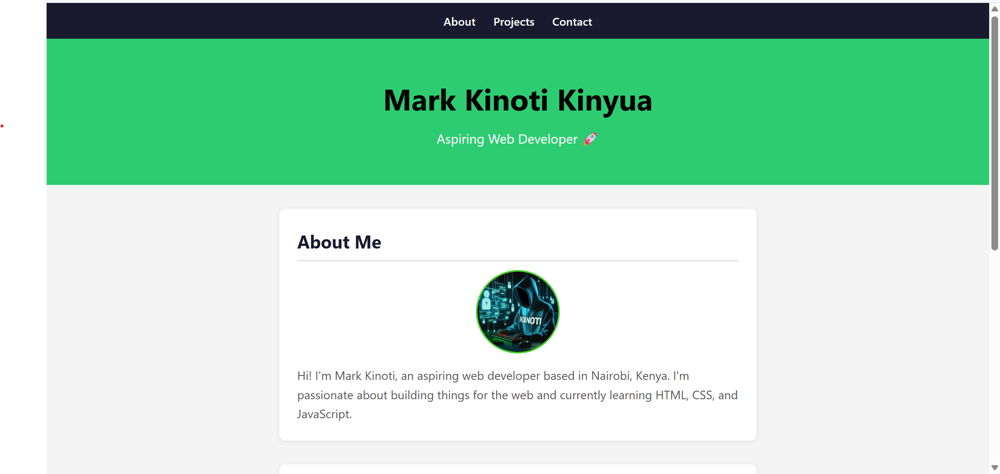

# 👋 Mark Kinoti — Portfolio Website

> 🚀 A personal portfolio website built with HTML & CSS to showcase my journey into web development.

---

## 🌐 Portfolio Website

🔗 https://mark-kinoti-portfolio.netlify.app/

---

## 🛠️ Tech Stack

* HTML5
* CSS3

---

## 📈 Development Progress

| Day   | Task             | Status         |
| ----- | ---------------- | -------------- |
| Day 1 | HTML Structure   | ✅ Completed    |
| Day 2 | CSS Styling      | ✅ Completed    |
| Day 3 | About Me + Photo | ✅ Completed    |
| Day 4 | Navigation Bar   | 🔜 In Progress |

---

## 🎯 Purpose

This project is part of my journey to:

* Learn front-end development
* Build real-world projects
* Improve my design and layout skills

---

## 📸 Preview

---

## 📬 Contact

* 📧 Email: [markkinoti685@gmail.com](mailto:markkinoti685@gmail.com)
* 💻 GitHub: https://github.com/KinotiDev

---

## ⚡ Next Steps

* Add projects section to portfolio
* Improve responsiveness
* Add interactivity with JavaScript
